# Hi, I'm Jr Peralta 

  

  Full-stack developer with experience building web applications, machine learning solutions,
  automation workflows, APIs, and cross-platform mobile applications.

---

<h2>
  
  &nbsp;About Me
</h2>

- Building modern web applications with **React.js**
- Developing backend systems and APIs with **Laravel** and **Flask**
- Working with **Machine Learning**, **Computer Vision**, and Python
- Building cross-platform applications using **Flutter**
- Designing and working with **MySQL** databases
- Containerizing applications with **Docker**
- Automating workflows and integrations using **n8n**
- Interested in building scalable, practical, and intelligent software solutions
---

<h2>
  
  &nbsp;Tech Stack
</h2>

### Frontend

  

### Backend

  

### Machine Learning & Computer Vision

  

**Libraries & Tools**

  
  
  

### Mobile Development

  

### Database

  

### DevOps & Automation

  

**Automation**

  

---

<h2>
  
  &nbsp;GitHub Stats
</h2>

  
  

  

---

<h2>
  
  &nbsp;Contribution Activity
</h2>

  <picture>
    <source
      media="(prefers-color-scheme: dark)"
      srcset="https://raw.githubusercontent.com/jrperalta2802/jrperalta2802/output/github-contribution-grid-snake-dark.svg"
    />
    <source
      media="(prefers-color-scheme: light)"
      srcset="https://raw.githubusercontent.com/jrperalta2802/jrperalta2802/output/github-contribution-grid-snake.svg"
    />
    
  </picture>

---

<h2>
  
  &nbsp;Connect With Me
</h2>

  

  

---

  <i>Building software, automating workflows, and exploring intelligent systems.</i>

